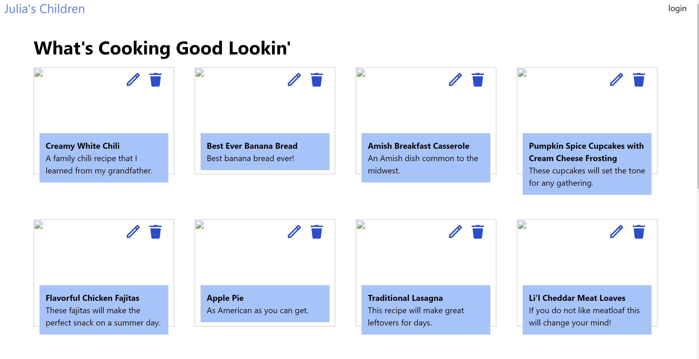
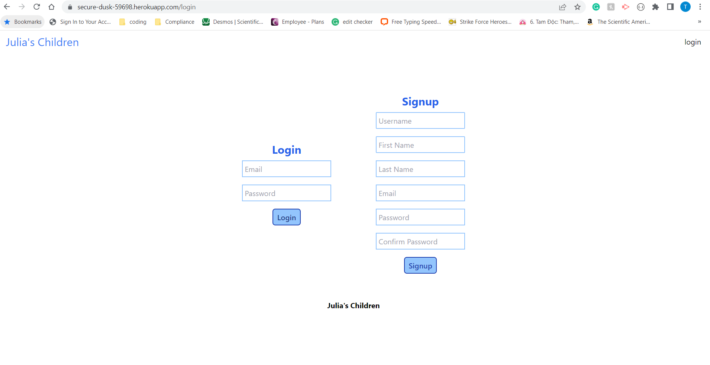
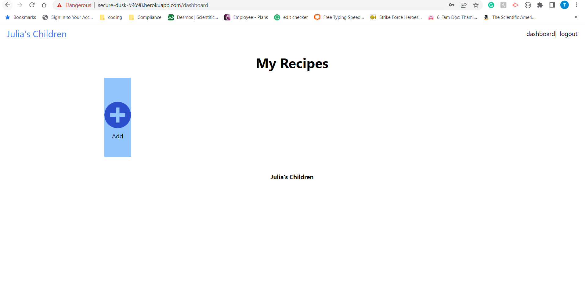
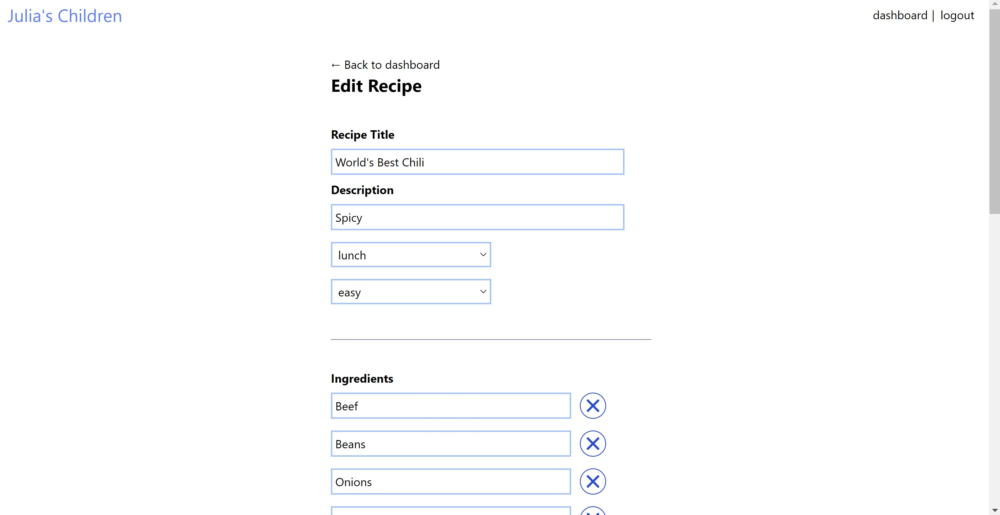

# Julia's children

## Table of Contents

* [Description](#description)
* [Installation](#installation)
* [Usage](#usage)
    * [As a viewer](#as-a-viewer)
    * [As a member](#as-a-member)
* [Credits](#credits)
* [License](#license)

## Description
As a skilled home chef, I want to have the right recipe with precise ingredients, and an appropriate tool to make a top quality dishes is needed. Julia's Children is a forum for chefs so that they can find recipes that match their skills, and share their unique recipes and knowledge thus anyone on this forum can be a masterchef.

## Installation
Pleas click the link to get the access to the app: [Julia's Children](https://secure-dusk-59698.herokuapp.com/).
If you want to install the application, follow the link to the [Public Repository](https://github.com/AlexandertheGreat491/Project-2.git).

## Usage
Chefs can find out recipe that can desire them to cook. They can [view and pick](#as-a-viewer) the recipe they like or [join-in](#as-a-member), posting their own recipe, discuss and making the dish better with their idea

### As a viewer
Chefs can access to any recipe that match their skill and tool that they are practicing

### As a member
Chefs need to create an ID 

Once they become member, they can post their recipe

They can also edit, making change to their recipe and even delete the recipe that they had posted

## Credits

Sources:

[Connect-Session-Sequelize](https://www.npmjs.com/package/connect-session-sequelize)

[Dotenv](https://www.npmjs.com/package/dotenv)

[Express Handlebars](https://www.npmjs.com/package/express-handlebars)

[Express Session](https://www.npmjs.com/package/express-session)

[HTML Color Picker](https://www.w3schools.com/colors/colors_picker.asp)

[Jest](https://jestjs.io/docs/getting-started)

[MySQL Reference Guide](https://coding-boot-camp.github.io/full-stack/mysql/mysql-reference-guide)

[Nodemon](https://www.npmjs.com/package/nodemon)

[Node.js](https://nodejs.org/api/path.html)

[Pixels to Ems Conversion](https://www.w3schools.com/tags/ref_pxtoemconversion.asp)

[Professional README Guide](https://coding-boot-camp.github.io/full-stack/github/professional-readme-guide)

[Sequelize](https://sequelize.org/v5/manual/getting-started.html)

[Sequelize](https://www.npmjs.com/package/sequelize)

[tailwindcss](https://www.npmjs.com/package/tailwindcss)

[Tailwind Docs](https://tailwindcss.com/docs/installation)

[Handlebars](https://handlebarsjs.com/guide/)

[Luke Channing](https://gist.github.com/LukeChannings/6173ab951d8b1dc4602e)

[W3 Schools](https://www.w3schools.com/jsref/event_composedpath.asp)

Collaborators:

[Alex Van Dyke], [Tran Loi], [Joey Rebne], [Jordan Degerness]

## License
### MIT

#### Copyright (c) [2022] [Alex Van Dyke],[Tran Loi],[Joey Rebne] and [Jordan Degerness]

##### Permission is hereby granted, free of charge, to any person obtaining a copy of this software and associated documentation files (the "Software"), to deal in the Software without restriction, including without limitation the rights to use, copy, modify, merge, publish, distribute, sublicense, and/or sell copies of the Software, and to permit persons to whom the Software is furnished to do so, subject to the following conditions:

##### The above copyright notice and this permission notice shall be included in all copies or substantial portions of the Software.

##### THE SOFTWARE IS PROVIDED "AS IS", WITHOUT WARRANTY OF ANY KIND, EXPRESS OR IMPLIED, INCLUDING BUT NOT LIMITED TO THE WARRANTIES OF MERCHANTABILITY, FITNESS FOR A PARTICULAR PURPOSE AND NONINFRINGEMENT. IN NO EVENT SHALL THE AUTHORS OR COPYRIGHT HOLDERS BE LIABLE FOR ANY CLAIM, DAMAGES OR OTHER LIABILITY, WHETHER IN AN ACTION OF CONTRACT, TORT OR OTHERWISE, ARISING FROM, OUT OF OR IN CONNECTION WITH THE SOFTWARE OR THE USE OR OTHER DEALINGS IN THE SOFTWARE.

[Alex Van Dyke]:https://github.com/AlexandertheGreat491
[Tran Loi]:https://github.com/LoiT1020
[Joey Rebne]:https://github.com/J0J0C0DING
[Jordan Degerness]:https://github.com/J0J0C0DING

